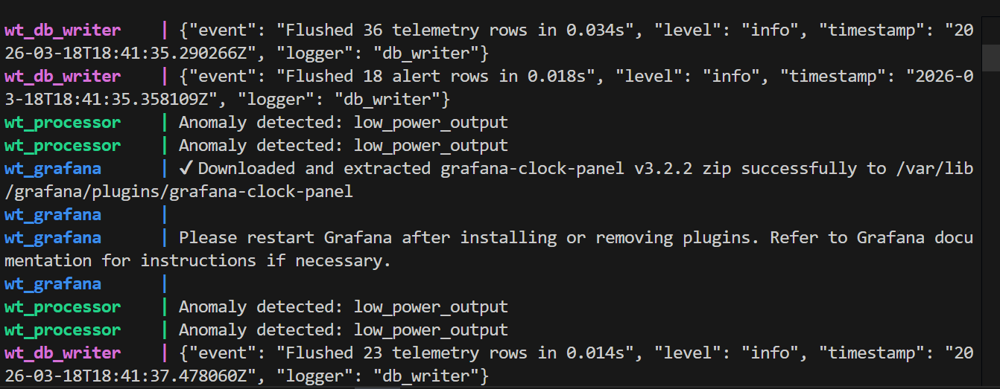
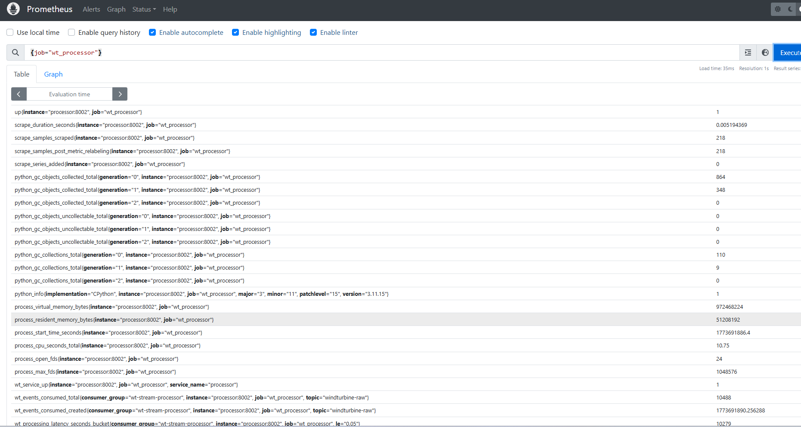
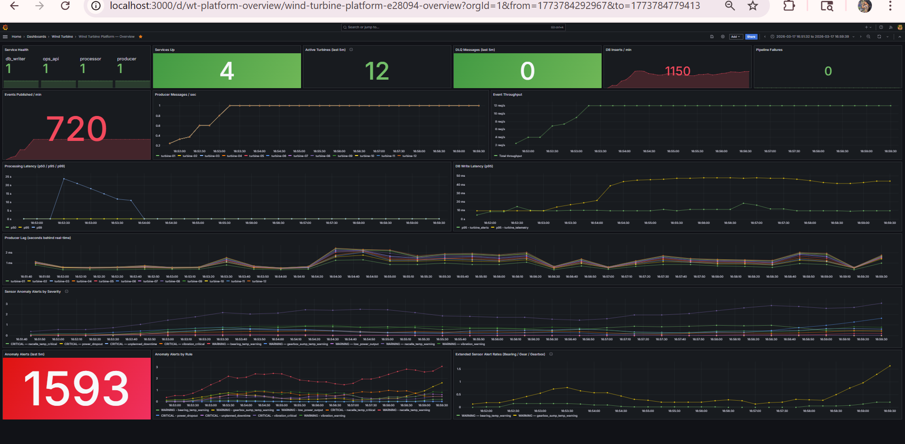
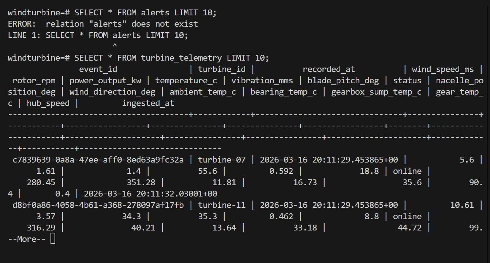

# Wind Turbine Streaming Data Platform

A real-time data streaming platform that simulates wind turbine telemetry, processes events using Kafka, stores processed data in TimescaleDB, and visualizes system metrics using Prometheus and Grafana.

This project demonstrates a modern data pipeline architecture using containerized microservices for ingestion, processing, monitoring, and storage.

---

# System Architecture

The platform is composed of several services working together to process wind turbine telemetry data.

Telemetry events are generated, streamed through Kafka, processed for anomalies, stored in TimescaleDB, and monitored through Prometheus and Grafana dashboards.

---

# Data Flow

1. Wind turbine telemetry events are simulated by the producer service.

2. Events are published to the Kafka topic `windturbine-raw`.

3. The processor service consumes events and performs validation and anomaly detection.

4. Processed telemetry data is written to TimescaleDB.

5. Alerts and abnormal events are published to additional Kafka topics.

6. Prometheus collects metrics from services.

7. Grafana visualizes metrics and system health through dashboards.

---

# Project Structure

wind-turbine-streaming-data-platform
│
├── images
│ ├── grafana_dashboard.png
│ ├── kafka_stream_output.png
│ ├── prometheus_metrics.png
│ └── timescaledb_output.png
│
├── sample_output
│ ├── telemetry_sample.csv
│ └── alerts_sample.csv
│
├── infra
│ ├── grafana
│ ├── prometheus
│ └── postgres
│
├── scripts
│
├── services
│ ├── producer
│ ├── processor
│ ├── db_writer
│ └── ops_api
│
├── shared
├── tests
│
├── docker-compose.yml
├── requirements.txt
├── pytest.ini
└── README.md

---

# Technologies Used

Python  
Apache Kafka  
Zookeeper  
TimescaleDB (PostgreSQL)  
Docker  
Prometheus  
Grafana  

---

# Kafka Topics

The platform uses the following Kafka topics.

| Topic | Description |
|------|-------------|
| windturbine-raw | Raw telemetry events |
| windturbine-alerts | Detected anomaly events |
| windturbine-dlq | Failed event processing messages |

---

# TimescaleDB Tables

Processed data is stored in the following tables.

| Table | Description |
|------|-------------|
| turbine_telemetry | Processed turbine telemetry data |
| turbine_alerts | Detected anomalies |
| dlq_events | Failed message events |

---

# Running the Platform

Clone the repository.

git clone https://github.com/Nikitha-120404/wind-turbine-streaming-data-platform.git

Move into the project directory.

cd wind-turbine-streaming-data-platform

Create environment variables file.

cp .env.example .env

Start all services using Docker.

docker compose up -d

---

# Accessing the Services

| Service | URL |
|------|------|
Grafana Dashboard | http://localhost:3000 |
Prometheus Metrics | http://localhost:9090 |
Ops API | http://localhost:8000 |

---

# Kafka Streaming Logs

The platform continuously processes streaming telemetry data through Kafka.

---

# Prometheus Metrics

Prometheus collects metrics from all services including processors and APIs.

---

# Grafana Dashboard

Grafana visualizes the system metrics and service health.

---

# TimescaleDB Stored Data

Processed telemetry data is stored in TimescaleDB tables.

---

# Sample Output Data

Example telemetry data generated by the platform.

sample_output/telemetry_sample.csv

Example anomaly alert data.

sample_output/alerts_sample.csv

---

# Testing

The project includes unit and integration tests.

Run tests using:

pytest

---

# Author

Nikitha Mandla  
Computer Science Student  
University of Missouri – Kansas City